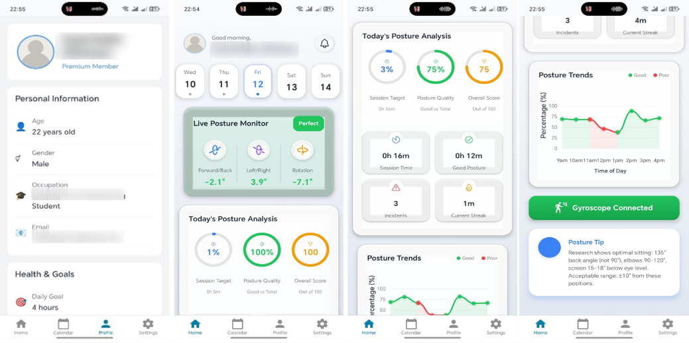
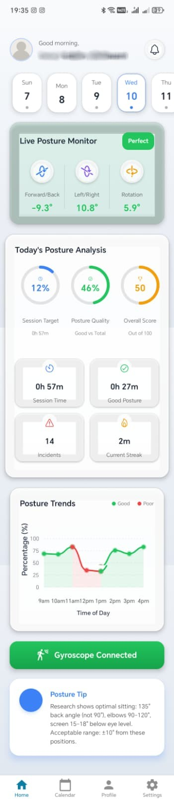
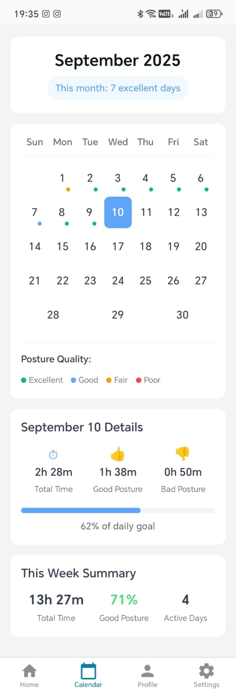

# 🧍‍♂️ Posture Guard  
### Smart IoT-Based Posture Monitoring System

A low-cost smart posture monitoring system that helps users maintain correct sitting posture using real-time sensor data and mobile feedback.

<p align="center">
  
</p>

---

## 🚀 Project Overview

**Posture Guard** is a wearable posture monitoring device built using **Arduino** and a **React Native (Expo)** mobile application.  
The system continuously tracks the user’s posture angle and provides instant feedback when poor posture is detected for a prolonged period.

It is designed especially for:
- Students
- Office workers
- Long sitting sessions

---

## 🛠️ System Architecture

<p align="center">
  
  
</p>

The system consists of:
- A sensor unit that detects posture tilt
- A microcontroller that processes data
- A mobile app that displays posture status in real time

---

## 🔩 Hardware Components

- Arduino Nano  
- MPU6050 (Accelerometer & Gyroscope)  
- Battery (Li-ion / Li-Po)  
- Bluetooth Module
- 3.3V Voltage Regulator

---

## 📱 Mobile Application

The mobile application was developed using **React Native with Expo**.  
It connects to the device via Bluetooth and allows the user to monitor posture status in real time.

<p align="center">
  
  
  
  
</p>

### Mobile App Features
- Live posture status
- User-friendly interface
- Wireless Bluetooth communication
- Lightweight and fast performance

---

## ⚙️ How the System Works

1. The MPU6050 sensor measures tilt angles of the user’s posture  
2. Arduino processes sensor data continuously  
3. Data is sent wirelessly to the mobile app  
4. The app displays posture status visually  

---

## ▶️ How to Run the Project

### Arduino
1. Open `posture_guard.ino` using Arduino IDE  
2. Select the correct board and port  
3. Upload the code to Arduino Nano


## 🔩 Mobile App

  ```bash
cd mobile-app
npm install
npx expo start

  ```

---

### 📜 License

This project was developed for educational and academic purposes.
